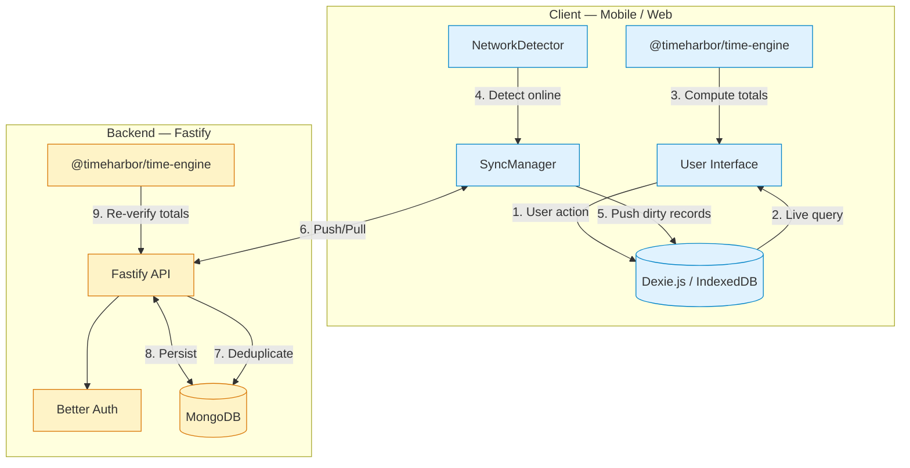
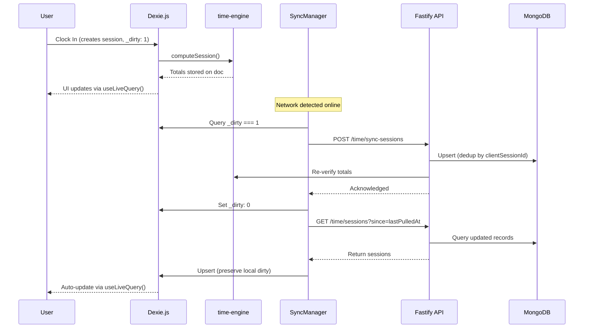

# TimeharborApp

A comprehensive **offline-first time tracking and team management platform** with cross-device sync, native mobile apps, and a shared calculation engine.

**YouTube Short**: https://youtube.com/shorts/MfPd4NsjLQQ?feature=share
**Live Demo**: https://timeharborapp.opensource.mieweb.org

## Project Structure

```
TimeharborApp/
├── timeharbourapp/                    # Frontend — Next.js + Capacitor
├── timeharbor-timehuddle-backend/     # Backend monorepo
│   ├── apps/api/                      #   Fastify API server
│   └── packages/time-engine/          #   Shared time calculation library
└── ychart/                            # Chart component library
```

| Component | Stack |
|-----------|-------|
| **Frontend** | Next.js 16, React 19, TypeScript, Tailwind CSS 4, Capacitor 8 |
| **Backend** | Fastify 5, MongoDB (native driver), Better Auth |
| **Mobile** | Capacitor — Android + iOS |
| **Offline** | Dexie.js (IndexedDB), field-level sync |
| **Testing** | Playwright (Chromium, WebKit, Mobile Chrome) |
| **Shared** | `@timeharbor/time-engine` — zero-dependency pure functions |

## Architecture


```mermaid
graph TD
    subgraph Client["Client — Mobile / Web"]
        UI[User Interface]
        Engine["@timeharbor/time-engine"]
        LocalDB[(Dexie.js / IndexedDB)]
        Sync[SyncManager]
        Net[NetworkDetector]

        UI -->|1. User action| LocalDB
        LocalDB -->|2. Live query| UI
        Engine -->|3. Compute totals| UI
        Net -->|4. Detect online| Sync
        Sync -->|5. Push dirty records| LocalDB
    end

    subgraph Server["Backend — Fastify"]
        API[Fastify API]
        Auth[Better Auth]
        DB[(MongoDB)]
        ServerEngine["@timeharbor/time-engine"]

        API --> Auth
        API <-->|8. Persist| DB
        ServerEngine -->|9. Re-verify totals| API
    end

    Sync <-->|6. Push/Pull| API
    API -->|7. Deduplicate| DB

    classDef client fill:#e0f2fe,stroke:#0284c7
    classDef server fill:#fef3c7,stroke:#d97706
    class UI,Engine,LocalDB,Sync,Net client
    class API,Auth,DB,ServerEngine server
```

## Key Features

- **Clock In/Out** with ticket-based time segments and break tracking
- **Per-session documents** — one self-contained doc per work session (not many tiny events)
- **Offline-first** — Dexie.js is the primary data store; all reads are local, writes optimistic
- **Bi-directional sync** — push dirty records, pull updates, field-level merge for conflicts
- **Shared calculation engine** — `@timeharbor/time-engine` runs identically on client and server
- **Multi-device support** — each device creates separate session docs, deduped by UUID
- **Push notifications** — FCM (Android) + APNs (iOS)
- **OAuth** — Google, Apple, Facebook via Better Auth
- **Biometric app lock** — native biometric authentication via Capacitor
- **Dark mode** — Tailwind CSS dark theme
- **Responsive** — mobile, tablet, desktop

## Data Model

Each work session is a single embedded document:

```json
{
  "clientSessionId": "sess-uuid",
  "userId": "user-id",
  "date": "2026-03-20",
  "clockIn": 1742457600000,
  "clockOut": 1742470200000,
  "ticketSegments": [
    { "segmentId": "seg-001", "ticketId": "T1", "ticketTitle": "Fix bug", "start": 1742457900000, "end": 1742463000000 }
  ],
  "breaks": [
    { "breakId": "brk-001", "start": 1742464800000, "end": 1742465700000 }
  ],
  "totalSessionMs": 12600000,
  "totalBreakMs": 900000,
  "netWorkMs": 11700000,
  "_dirty": 0,
  "_rev": 8
}
```

Pre-computed totals are cached for instant dashboard reads. Raw data is always preserved so totals can be recomputed.

## Sync Flow


```mermaid
sequenceDiagram
    participant User
    participant Dexie as Dexie.js
    participant Engine as time-engine
    participant Sync as SyncManager
    participant API as Fastify API
    participant Mongo as MongoDB

    User->>Dexie: Clock In (creates session, _dirty: 1)
    Dexie->>Engine: computeSession()
    Engine-->>Dexie: Totals stored on doc
    Dexie-->>User: UI updates via useLiveQuery()

    Note over Sync: Network detected online
    Sync->>Dexie: Query _dirty === 1
    Sync->>API: POST /time/sync-sessions
    API->>Mongo: Upsert (dedup by clientSessionId)
    API->>Engine: Re-verify totals
    API-->>Sync: Acknowledged
    Sync->>Dexie: Set _dirty: 0

    Sync->>API: GET /time/sessions?since=lastPulledAt
    API->>Mongo: Query updated records
    API-->>Sync: Return sessions
    Sync->>Dexie: Upsert (preserve local dirty)
    Dexie-->>User: Auto-update via useLiveQuery()
```

## Getting Started

### Prerequisites

- Node.js v18+
- MongoDB
- Android Studio (for Android builds)
- Xcode (for iOS builds, macOS only)

### 1. Backend Setup

```bash
cd timeharbor-timehuddle-backend/apps/api
npm install
```

Create a `.env` file:

```env
PORT=3001
NODE_ENV=development
DATABASE_URL=mongodb://localhost:27017/timeharbor
BETTER_AUTH_SECRET=your-secret
FRONTEND_URL=http://localhost:3000
```

Start the server:

```bash
npm run dev
```

The API will be available at `http://localhost:3001`.

### 2. Frontend Setup

```bash
cd timeharbourapp
npm install
```

Create a `.env.local` file:

```env
NEXT_PUBLIC_API_URL=http://localhost:3001
NEXT_PUBLIC_BETTER_AUTH_URL=http://localhost:3001
```

Start the dev server:

```bash
npm run dev
```

The app will be available at `http://localhost:3000`.

### 3. Mobile Development

```bash
cd timeharbourapp

# Development (opens IDE for live reload)
npm run dev:android    # Android Studio
npm run dev:ios        # Xcode

# Production (optimized Next.js build + sync)
npm run prod:android
npm run prod:ios
```

## API Endpoints

All routes under `/api/timeharbor`:

| Method | Endpoint | Description |
|--------|----------|-------------|
| `GET` | `/me/profile` | Get profile (auto-creates on first visit) |
| `PUT` | `/me/profile` | Update display name, social links |
| `POST` | `/me/register-device` | Register FCM push token |
| `POST` | `/me/tickets` | Create personal ticket |
| `GET` | `/me/tickets` | List personal tickets |
| `PUT` | `/me/tickets/:ticketId` | Update ticket |
| `DELETE` | `/me/tickets/:ticketId` | Soft-delete ticket |
| `POST` | `/time/sync-sessions` | Push sessions (dedup by clientSessionId) |
| `GET` | `/time/sessions` | Pull sessions since lastPulledAt |
| `GET` | `/dashboard/stats` | Time stats + live session |
| `GET` | `/dashboard/activity` | Recent activity feed |
| `POST` | `/dashboard/activity/reply` | Reply to work log |
| `GET` | `/dashboard/timesheet` | Daily hour totals |
| `GET` | `/notifications` | List notifications |
| `PATCH` | `/notifications/:id/read` | Mark notification read |
| `POST` | `/projects` | Create project |
| `GET` | `/projects` | List projects |

## Shared Calculation Engine

`@timeharbor/time-engine` is a zero-dependency package of pure functions that compute time totals from raw session data. It runs identically on client and server.

```typescript
import { computeSession, computeDay } from '@timeharbor/time-engine';

// Compute a single session
const stats = computeSession(session, Date.now());
// → { totalSessionMs, netWorkMs, totalBreakMs, ticketBreakdown[], untrackedMs, isOpen }

// Aggregate all sessions for a date
const dayStats = computeDay(sessions, '2026-03-20', Date.now());
// → { daily totals, merged ticket breakdown, sessionCount }
```

Breaks are subtracted proportionally from overlapping ticket segments. Untracked time (gaps between segments) is calculated separately.

## Testing

```bash
cd timeharbourapp

npm run test            # Run all tests
npm run test:headed     # Run with browser UI
npm run test:debug      # Debug mode
npm run test:report     # Show HTML report
```

Tests run against Chromium, WebKit, and Mobile Chrome (Pixel 7). See `playwright.config.ts` for configuration.

## Production Deployment

```bash
# Build backend
cd timeharbor-timehuddle-backend/apps/api
npm run build

# Build frontend
cd ../../timeharbourapp
npm run build

# Start with PM2
cd ..
pm2 start ecosystem.config.js
```

## Further Reading

- [ARCHITECTURE.md](ARCHITECTURE.md) — Full system architecture (Timeharbor + Timehuddle)
- [TIMEHARBOR-CORE.md](TIMEHARBOR-CORE.md) — Core MVP: profiles, tickets, work sessions

### Monitoring Logs

View combined logs:
```bash
tail -f express-api/logs/combined.log
```

View error logs only:
```bash
tail -f express-api/logs/error.log
```


## Troubleshooting

### Push Notifications Not Working

1. **Android (FCM)**:
   - Verify `firebase-service-account.json` is in the `express-api` directory
   - Check `FIREBASE_SERVICE_ACCOUNT_PATH` in `.env`
   - Ensure the app is registered in Firebase Console
   - Verify the package name matches in Firebase and Capacitor config

2. **iOS (APNs)**:
   - Verify `.p8` key file is in the `express-api` directory
   - Check all APN environment variables in `.env`
   - Ensure the bundle ID matches in Apple Developer Portal and Capacitor config
   - Test with development mode first (`APN_PRODUCTION=false`)

### Sync Issues

1. Check network detector status in console logs
2. Verify API_URL environment variable
3. Check browser/app console for sync errors
4. Manually trigger sync from the app

### Database Connection Issues

1. Verify PostgreSQL is running
2. Check `DATABASE_URL` in `.env`
3. Ensure database exists: `createdb timeharbor`
4. Run migrations: `npx sequelize-cli db:migrate`

## Technology Stack

### Backend
*   **Node.js** with **Express** and **TypeScript**
*   **PostgreSQL** with **Sequelize ORM**
*   **JWT** for authentication
*   **BCrypt** for password hashing
*   **Winston** for logging
*   **Firebase Admin SDK** for FCM
*   **node-apn** for APNs
*   **node-cron** for scheduled jobs

### Frontend/Mobile
*   **Next.js 16** with **React 19**
*   **Tailwind CSS 4** for styling
*   **Capacitor 8** for mobile builds
*   **Dexie.js** for local database
*   **Playwright** for E2E testing
*   **Lucide React** for icons

### DevOps
*   **PM2** for process management
*   **Sequelize CLI** for migrations
*   **Nodemon** for development
*   **Serve** for static file serving

## Contributing

1. Fork the repository
2. Create a feature branch
3. Make your changes
4. Run tests
5. Submit a pull request

