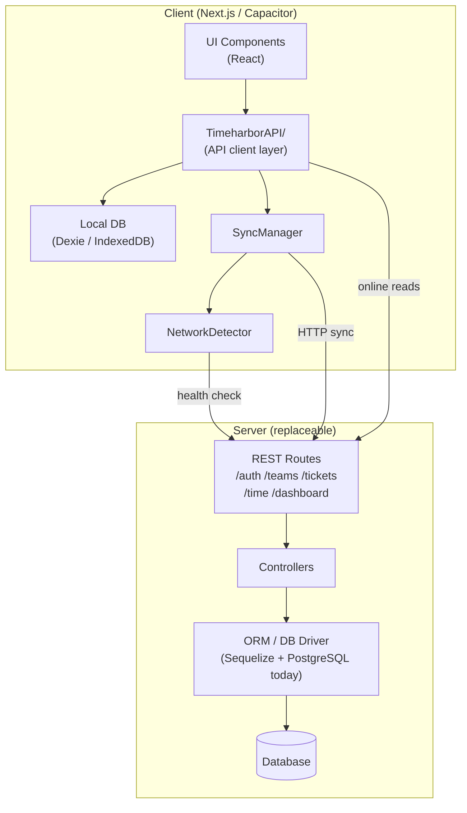
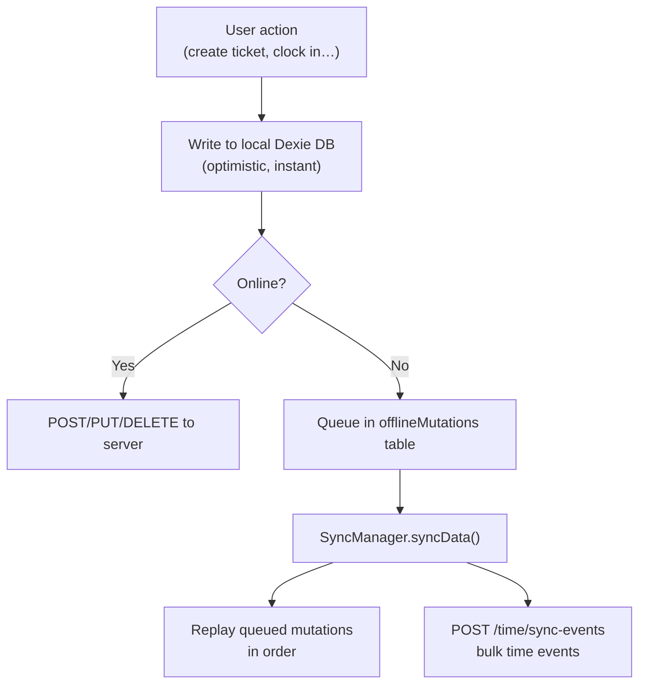

# Client–Server Separation of Concerns

## Summary

The client operates fully offline-first. The server is **not** canonical storage — the client's local Dexie/IndexedDB database is the source of truth for the user's device. The server is the synchronisation target and provides the multi-user, multi-device view.

This design means the Express/PostgreSQL backend can be swapped for any server that speaks the same HTTP contract (Python/FastAPI + MySQL, TypeScript/Hono + MongoDB, etc.) with **no changes to the client**.

---

## Layered Architecture



---

## The API Layer: `TimeharborAPI/`

`timeharbourapp/TimeharborAPI/` is the **only** place in the client that knows the server exists. Nothing outside this folder should call `fetch` against the backend directly.

| Module | Responsibility |
|---|---|
| `apiUrl.ts` | Resolves the backend base URL from env or `window.location.origin/api` |
| `auth/` | Sign-up, sign-in, token refresh, sign-out, profile reads |
| `teams/` | CRUD for teams and members, offline queue |
| `tickets/` | CRUD for tickets, offline queue |
| `dashboard/` | Stats and activity reads |
| `notifications/` | Notification reads and updates |
| `time/TimeService.ts` | Bulk sync of local time events to the server |
| `db.ts` | Dexie schema — the local offline store |
| `SyncManager.ts` | Orchestrates mutation replay and time-event sync |
| `NetworkDetector.ts` | Detects online/offline/backend-unreachable states |

### Offline-first flow



Temporary client-generated UUIDs are reconciled with server-assigned IDs after a successful POST. `SyncManager.updateLocalIds()` patches all subsequent queued mutations and local records to use the real ID.

---

## The API Contract

These are the endpoints the client calls. Any server implementation must honour this contract.

### Authentication — `/auth`

| Method | Path | Description |
|---|---|---|
| `POST` | `/auth/signup` | Create account |
| `POST` | `/auth/signin` | Sign in, returns `access_token` + `refresh_token` |
| `POST` | `/auth/refresh` | Exchange refresh token for new access token |
| `POST` | `/auth/signout` | Invalidate session |
| `POST` | `/auth/forgot-password` | Trigger password reset email |
| `POST` | `/auth/reset-password` | Apply new password with token |
| `GET` | `/auth/me` | Current user profile |
| `PUT` | `/auth/me` | Update profile |
| `POST` | `/auth/register-device` | Register push notification device token |

### Teams — `/teams`

| Method | Path | Description |
|---|---|---|
| `GET` | `/teams` | List teams the current user belongs to |
| `POST` | `/teams` | Create a team |
| `POST` | `/teams/join` | Join a team by code |
| `PUT` | `/teams/:id` | Update team details |
| `DELETE` | `/teams/:id` | Delete a team |
| `POST` | `/teams/:id/members` | Add a member |
| `DELETE` | `/teams/:id/members/:userId` | Remove a member |
| `PUT` | `/teams/:id/members/:userId/role` | Update member role |

### Tickets — `/teams/:teamId/tickets`

| Method | Path | Description |
|---|---|---|
| `POST` | `/teams/:teamId/tickets` | Create ticket (client sends pre-generated UUID) |
| `GET` | `/teams/:teamId/tickets` | List tickets for team |
| `PUT` | `/teams/:teamId/tickets/:ticketId` | Update ticket |
| `DELETE` | `/teams/:teamId/tickets/:ticketId` | Delete ticket |

### Time Sync — `/time`

| Method | Path | Description |
|---|---|---|
| `POST` | `/time/sync-events` | Bulk upsert time events (`CLOCK_IN`, `CLOCK_OUT`, `START_TICKET`, `STOP_TICKET`, `BREAK_START`, `BREAK_END`) |

#### `POST /time/sync-events` payload

```json
{
  "events": [
    {
      "id": "uuid",
      "userId": "uuid",
      "type": "CLOCK_IN | CLOCK_OUT | START_TICKET | STOP_TICKET | BREAK_START | BREAK_END",
      "timestamp": "ISO-8601",
      "ticketId": "uuid | null",
      "teamId": "uuid | null",
      "ticketTitle": "string | null",
      "comment": "string | null",
      "link": "string | null"
    }
  ]
}
```

### Dashboard — `/dashboard`

| Method | Path | Description |
|---|---|---|
| `GET` | `/dashboard/stats` | Aggregated time stats (day / week) |
| `GET` | `/dashboard/activity` | Recent activity feed |
| `POST` | `/dashboard/activity/reply` | Add a reply to an activity item |
| `GET` | `/dashboard/member/:memberId` | Activity for a specific member |
| `GET` | `/dashboard/timesheet` | Timesheet totals |

### Notifications — `/notifications`

| Method | Path | Description |
|---|---|---|
| `GET` | `/notifications` | List notifications |
| `PATCH` | `/notifications/:id/read` | Mark one as read |
| `PATCH` | `/notifications/read-all` | Mark all as read |
| `DELETE` | `/notifications/:id` | Delete one |
| `DELETE` | `/notifications` | Delete many |

### Health — `/health`

| Method | Path | Description |
|---|---|---|
| `HEAD` | `/health` | Liveness check used by `NetworkDetector` |

---

## Auth Protocol

All protected endpoints require:

```
Authorization: Bearer <access_token>
```

The client manages token lifecycle in `TimeharborAPI/auth/`:
- Tokens are stored in `localStorage` (web) / device keychain (native via Capacitor).
- `authenticatedFetch()` automatically attaches the header and refreshes the token on 401.
- The server is stateless with respect to sessions — JWTs only.

---

## Replacing the Server

Because all server interaction is isolated to `TimeharborAPI/`, replacing the backend requires:

1. Implement the endpoints in the table above.
2. Return the same JSON shapes (see existing controllers for field names).
3. Issue JWTs with the same `access_token` / `refresh_token` / `expires_in` fields on sign-in.
4. Honour `HEAD /health` with a 200 response.

The client does not care about:
- The language or framework used.
- The database engine (PostgreSQL, MySQL, MongoDB, SQLite).
- Whether the server is a monolith or microservices.
- Push notifications (optional — the client registers a device token but degrades gracefully if `/auth/register-device` is absent).

---

## What Is Currently Coupled (known rough edges)

| Issue | Location | Notes |
|---|---|---|
| `/api/` prefix stripping | `SyncManager.processMutation()` | Mutation URLs are stored with a `/api/` prefix (matching the Next.js proxy) and stripped before hitting the backend directly. Should be normalised at queue time. |
| Dashboard reads bypass offline queue | `TimeharborAPI/dashboard/` | Dashboard data is fetched live and cached in Dexie. It is not queued for sync — stale data is shown when offline. |
| No schema versioning on the API contract | — | The local Dexie schema is versioned; the REST API is not. A breaking server change requires a coordinated client release. |

---

## Local Data Model (Dexie)

Defined in `TimeharborAPI/db.ts`. This is the **client's source of truth** — independent of any server schema.

| Table | Key | Purpose |
|---|---|---|
| `events` | `id` | Time events pending or already synced |
| `offlineMutations` | `++id` | Ordered queue of mutations to replay |
| `teams` | `id` | Cached team data |
| `tickets` | `id, teamId` | Cached ticket data |
| `dashboardStats` | `teamId` | Cached dashboard aggregates |
| `dashboardActivity` | `id, teamId` | Cached activity feed |
| `activityLogs` | `id, teamId, startTime` | Cached activity logs |
| `profile` | `key` | Current user profile |
