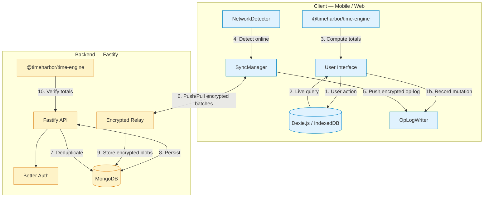
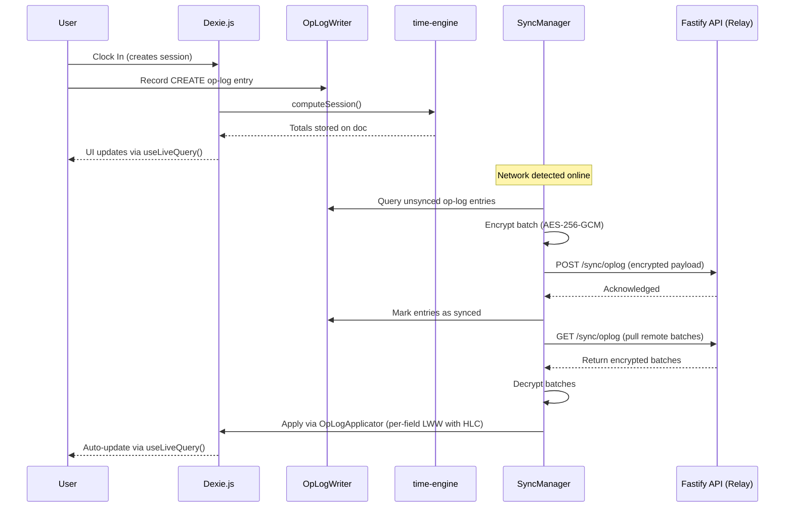

# TimeharborApp

A comprehensive **offline-first time tracking and team management platform** with encrypted cross-device sync, native mobile apps, and a shared calculation engine.

**YouTube Short**: https://youtube.com/shorts/MfPd4NsjLQQ?feature=share
**Live Demo**: https://timeharborapp.opensource.mieweb.org

---

## Project Structure

```
TimeharborApp/
├── timeharbourapp/                    # Frontend — Next.js + Capacitor
├── timeharbor-timehuddle-backend/     # Backend monorepo
│   ├── apps/api/                      #   Fastify API server
│   └── packages/time-engine/          #   Shared time calculation library
└── ychart/                            # Chart component library
```

| Component | Stack |
|-----------|-------|
| **Frontend** | Next.js 16, React 19, TypeScript, Tailwind CSS 4, Capacitor 8 |
| **Backend** | Fastify 5, MongoDB (native driver), Better Auth |
| **Mobile** | Capacitor — Android + iOS |
| **Offline** | Dexie.js (IndexedDB), encrypted op-log sync |
| **Testing** | Playwright (Chromium, WebKit, Mobile Chrome) |
| **Shared** | `@timeharbor/time-engine` — zero-dependency pure functions |

## Tech Stack

- **Next.js 16** with React 19 and TypeScript
- **Tailwind CSS 4** + Sass for styling
- **Capacitor 8** for native Android & iOS builds
- **Dexie.js** for offline-first IndexedDB storage
- **Socket.io** for real-time updates
- **Better Auth** for authentication (email + OAuth)
- **Playwright** for end-to-end testing
- **FullCalendar** for calendar views
- **BlockNote** for rich-text editing

## Key Features

- **Clock In/Out** with ticket-based time segments and break tracking
- **Per-session documents** — one self-contained doc per work session
- **Offline-first** — Dexie.js is the primary data store; all reads are local, writes optimistic
- **Encrypted op-log sync** — AES-256-GCM encrypted, zero-knowledge server relay
- **Per-field conflict resolution** — HLC-based Last-Writer-Wins via op-log
- **Shared calculation engine** — `@timeharbor/time-engine` runs identically on client and server
- **Multi-device support** — each device creates separate session docs, deduped by UUID
- **Push notifications** — FCM (Android) + APNs (iOS)
- **OAuth** — Google, Apple, Facebook via Better Auth
- **Biometric app lock** — native biometric authentication via Capacitor
- **Dark mode** — Tailwind CSS dark theme
- **Responsive** — mobile, tablet, desktop

---

## Architecture



---

## App Structure

```
app/
├── (auth)/                # Auth pages (login, forgot/reset password)
├── dashboard/             # Main app (protected)
│   ├── activity/          # Time tracking history
│   ├── calendar/          # Calendar view
│   ├── tickets/           # Ticket management
│   ├── projects/          # Project grouping
│   ├── notifications/     # Notifications
│   ├── settings/          # User settings
│   ├── pulse/             # Pulse / stories
│   ├── notepad/           # Notes
│   └── oplogs/            # Operation logs
├── share/                 # Public share pages
├── layout.tsx             # Root layout
└── page.tsx               # Landing page
```

### Key Directories

| Directory | Purpose |
|-----------|---------|
| `components/` | React components (UI, dashboard, auth) |
| `contexts/` | React contexts (notifications, socket, walkthrough) |
| `hooks/` | Custom hooks (logger, push notifications) |
| `lib/` | Utilities (auth client, date presets, formatting) |
| `TimeharborAPI/` | API service layer, Dexie DB, SyncManager, op-log sync |
| `tests/` | Playwright E2E tests, fixtures, page objects |

---

## Offline-First Architecture

All data flows through Dexie.js (IndexedDB) with an encrypted op-log sync model:

1. **User actions** write to Dexie first, then `OpLogWriter` appends a CREATE/UPDATE/DELETE entry to the `opLog` table
2. **UI reads** from Dexie via `useLiveQuery()` — instant, no network
3. **SyncManager** pushes unsynced op-log entries (AES-256-GCM encrypted) when online
4. **Server relays** encrypted batches to other devices (zero-knowledge — cannot decrypt)
5. **Pull** applies remote ops via `OpLogApplicator` using per-field Last-Writer-Wins with HLC timestamps

### Sync Flow



### Sync Key Concepts

| Concept | Approach |
|---------|----------|
| **Mutation recording** | `OpLogWriter` appends structured entries (CREATE/UPDATE/DELETE) to `opLog` table |
| **Encryption** | AES-256-GCM — server is a zero-knowledge relay, cannot read data |
| **Conflict resolution** | Per-field Last-Writer-Wins using Hybrid Logical Clock (HLC) timestamps |
| **Idempotency** | Applied ops tracked in `appliedOps` table to prevent duplicates |
| **Key caching** | `cachedKeys` table persists sync encryption key across reloads |
| **Device tracking** | `deviceKeys` stores per-device encryption key records |

### Dexie Tables

```
profile           — Per-app user profile (key-value)
events            — Time tracking events (clock in/out, breaks)
teams             — Team information and membership
tickets           — Project tickets with status
projects          — Projects with status, color, repo links
workSessions      — Time sessions with ticket segments & breaks
notes             — User notes with BlockNote content
activityLogs      — Activity log entries
dashboardStats    — Team dashboard statistics
dashboardActivity — Team activity summaries
operationLogs     — Operation audit trail (success/failure)
opLog             — Encrypted op-log entries (core sync)
deviceKeys        — Encryption key records per device
appliedOps        — Deduplication for remote ops
cachedKeys        — Persistent sync key cache
userProfiles      — User profiles synced via op-log
syncMeta          — Sync cursors per collection
```

---

## Data Model

Each work session is a single embedded document (not many tiny events):

```json
{
  "clientSessionId": "sess-uuid",
  "userId": "user-id",
  "date": "2026-03-20",
  "clockIn": 1742457600000,
  "clockOut": 1742470200000,
  "ticketSegments": [
    { "segmentId": "seg-001", "ticketId": "T1", "ticketTitle": "Fix bug", "start": 1742457900000, "end": 1742463000000 }
  ],
  "breaks": [
    { "breakId": "brk-001", "start": 1742464800000, "end": 1742465700000 }
  ],
  "totalSessionMs": 12600000,
  "totalBreakMs": 900000,
  "netWorkMs": 11700000
}
```

Pre-computed totals are cached for instant dashboard reads. Raw data is always preserved so totals can be recomputed.

### Session Mutation Flow

Each user action updates the current session document in Dexie, then recomputes totals using `computeSession()`:

| User Action | Document Change |
|-------------|-----------------|
| **Clock in** | Create new session: `{ clockIn, ticketSegments: [], breaks: [] }` |
| **Start ticket** | Push to `ticketSegments`: `{ segmentId, ticketId, start, end: null }` |
| **Stop ticket** | Set `end` on the segment where `end === null` |
| **Switch ticket** | Close current segment, push new segment |
| **Start break** | Close active segment (remember `preBreakTicketId`), push to `breaks` |
| **End break** | Set `end` on open break; resume previous ticket if applicable |
| **Clock out** | Close everything: set `clockOut`, close open segments and breaks |

### The Three Data Layers

```
Layer 1: RAW DATA (owned by client, stored on session doc)
  clockIn, clockOut, ticketSegments[], breaks[]
  Created in Dexie. Synced via encrypted op-log.

Layer 2: DERIVED STATS (computed by @timeharbor/time-engine)
  totalSessionMs, totalBreakMs, netWorkMs, ticketBreakdown
  Computed by computeSession() on BOTH client and server.
  Stored as cache — always recomputable from Layer 1.

Layer 3: DAILY AGGREGATES (server-side cache)
  userDailyStats collection
  Server sums Layer 2 across all sessions for a date.
  Client can also compute locally from Dexie sessions.
```

---

## Shared Calculation Engine

`@timeharbor/time-engine` is a zero-dependency package of pure functions that compute time totals from raw session data. It runs identically on client and server — same input + same algorithm = same numbers, always.

```
timeharbor-timehuddle-backend/
  packages/
    time-engine/
      src/
        types.ts            — RawSession, SessionStats, DayStats interfaces
        computeSession.ts   — pure function: session → stats
        computeDay.ts       — pure function: sessions[] → day totals
        index.ts            — barrel export
```

```typescript
import { computeSession, computeDay } from '@timeharbor/time-engine';

// Compute a single session
const stats = computeSession(session, Date.now());
// → { totalSessionMs, netWorkMs, totalBreakMs, ticketBreakdown[], untrackedMs, isOpen }

// Aggregate all sessions for a date
const dayStats = computeDay(sessions, '2026-03-20', Date.now());
// → { daily totals, merged ticket breakdown, sessionCount }
```

**Rules for this module:**
1. Zero dependencies (no `date-fns`, no `luxon`, no `mongodb`)
2. All timestamps are UTC epoch milliseconds (`number`)
3. All functions are pure: input → output, no side effects, no `Date.now()`
4. `referenceTime` is always passed in (for open sessions), never read from the system clock

Breaks are subtracted proportionally from overlapping ticket segments. Untracked time (gaps between segments) is calculated separately.

### Multi-Device: How Day Totals Work

Each device creates separate session documents (different `clientSessionId`). On sync, both insert — no merge needed. Day totals sum all sessions:

```
Phone:  Clock in 09:00, work on T1, clock out 12:30  → 3h 30m
Laptop: Clock in 14:00, work on T2, clock out 17:00  → 3h

computeDay([phone-session, laptop-session]) → 6h 30m total
```

### Capacitor Bundling

`@timeharbor/time-engine` ships inside the Next.js bundle. When building for Capacitor (iOS/Android), Webpack/Turbopack resolves and tree-shakes it into the JS output. It runs in the WebView — no server needed, works fully offline.

---

## API Endpoints

All routes under `/api/timeharbor`:

| Method | Endpoint | Description |
|--------|----------|-------------|
| `GET` | `/me/profile` | Get profile (auto-creates on first visit) |
| `PUT` | `/me/profile` | Update display name, social links |
| `POST` | `/me/register-device` | Register FCM push token |
| `POST` | `/me/tickets` | Create personal ticket |
| `GET` | `/me/tickets` | List personal tickets |
| `PUT` | `/me/tickets/:ticketId` | Update ticket |
| `DELETE` | `/me/tickets/:ticketId` | Soft-delete ticket |
| `POST` | `/time/sync-sessions` | Push sessions (dedup by clientSessionId) |
| `GET` | `/time/sessions` | Pull sessions since lastPulledAt |
| `GET` | `/dashboard/stats` | Time stats + live session |
| `GET` | `/dashboard/activity` | Recent activity feed |
| `POST` | `/dashboard/activity/reply` | Reply to work log |
| `GET` | `/dashboard/timesheet` | Daily hour totals |
| `GET` | `/notifications` | List notifications |
| `PATCH` | `/notifications/:id/read` | Mark notification read |
| `POST` | `/projects` | Create project |
| `GET` | `/projects` | List projects |

### Encrypted Op-Log Sync Endpoints

| Method | Endpoint | Description |
|--------|----------|-------------|
| `POST` | `/sync/oplog` | Push encrypted op-log batches |
| `GET` | `/sync/oplog` | Pull encrypted batches from other devices |
| `DELETE` | `/sync/oplog/compact` | Remove old consumed batches |
| `DELETE` | `/sync/oplog/purge` | Purge all sync data |
| `GET` | `/sync/oplog/status` | Check if user has sync data |

---

## MongoDB Collections

| Collection | Purpose |
|-----------|---------|
| `profiles` | Per-app user profile (display name, social links, FCM token) |
| `tickets` | Personal + team tickets (unified, soft-deletable) |
| `workSessions` | Per-session documents with embedded segments & breaks |
| `projects` | Project grouping for tickets |
| `activityLogs` | Activity entries (append-only, dedup by `activityId`) |
| `notifications` | Server-authoritative alerts |
| `userDailyStats` | Pre-computed daily time totals |
| `teams` | Team information (Timehuddle-owned, read-only in Timeharbor) |
| `members` | Team membership |
| `workLogs` | Time events (append-only, dedup by `clientEventId`) |
| `workLogReplies` | Comments on work logs |
| `pulseAttachments` | Video recordings + stories |
| `presenceHeartbeats` | WebSocket presence (ephemeral, TTL auto-cleanup) |
| `syncMeta` | Per-user sync cursors |
| `accountLinks` | Deeplink-based profile linking tokens |
| `sharingPreferences` | Cross-app consent settings |
| `bridgeEvents` | Cross-app audit trail |

---

## Background Jobs

| Job | Trigger | Purpose |
|-----|---------|---------|
| Auto-close orphaned sessions | Cron (hourly) | Close sessions open > 12h, recompute totals |
| Cleanup expired pulse | Cron (daily) | Delete pending pulse attachments past expiry |
| Recompute daily stats | On time sync | Recalculate `userDailyStats` for affected dates |
| Stale presence cleanup | MongoDB TTL index | Auto-remove heartbeats after 2 min stale |

---

## Getting Started

### Prerequisites

- Node.js v18+
- MongoDB
- Android Studio (for Android builds)
- Xcode (for iOS builds, macOS only)

### 1. Backend Setup

```bash
cd timeharbor-timehuddle-backend/apps/api
npm install
```

Create a `.env` file:

```env
PORT=3001
NODE_ENV=development
DATABASE_URL=mongodb://localhost:27017/timeharbor
BETTER_AUTH_SECRET=your-secret
FRONTEND_URL=http://localhost:3000
```

Start the server:

```bash
npm run dev
```

API available at `http://localhost:3001`.

### 2. Frontend Setup

```bash
cd timeharbourapp
npm install
```

Create a `.env.local` file:

```env
NEXT_PUBLIC_API_URL=http://localhost:3001
NEXT_PUBLIC_BETTER_AUTH_URL=http://localhost:3001
```

Start the dev server:

```bash
npm run dev
```

App available at `http://localhost:3000`.

---

## Mobile Development

### Development (live reload)

```bash
npm run dev:android    # Opens Android Studio
npm run dev:ios        # Opens Xcode
```

### Production (optimized build)

```bash
npm run prod:android   # Next.js build + Capacitor sync + Android Studio
npm run prod:ios       # Next.js build + Capacitor sync + Xcode
```

### Native Plugins

- `@capacitor/push-notifications` — FCM + APNs
- `@capacitor/network` — Online/offline detection
- `@capacitor/clipboard` — Copy/paste
- `@capacitor/app` — Background/foreground lifecycle
- `@capgo/capacitor-social-login` — Google, Apple OAuth
- `@capgo/capacitor-native-biometric` — Biometric app lock

---

## Testing

```bash
npm run test            # Run all E2E tests
npm run test:headed     # Run with visible browser
npm run test:debug      # Debug mode
npm run test:report     # Open HTML report
```

Tests cover Chromium, WebKit, and Mobile Chrome (Pixel 7). See `playwright.config.ts` for full configuration.

### Test Structure

```
tests/
├── e2e/              # Test specs (grouped by feature)
│   ├── dashboard.spec.ts
│   ├── offline-tickets.spec.ts
│   ├── offline-time-engine.spec.ts
│   ├── profile.spec.ts
│   ├── settings.spec.ts
│   ├── ticket-timers.spec.ts
│   ├── tickets.spec.ts
│   ├── time-engine.spec.ts
│   └── walkthrough.spec.ts
├── fixtures/         # Custom Playwright fixtures
│   └── auth.fixture.ts
├── helpers/          # Shared utilities and selectors
└── pages/            # Page Object Model classes
```

### Adding New Tests

1. **Page Object** — add a new class in `pages/` extending `BasePage`
2. **Spec file** — create `tests/e2e/<feature>.spec.ts`
3. If the test needs an authenticated user, import from `fixtures/auth.fixture` and use the `authedPage` fixture

---

## Production Deployment

```bash
# Build backend
cd timeharbor-timehuddle-backend/apps/api
npm run build

# Build frontend
cd ../../timeharbourapp
npm run build

# Start with PM2
cd ..
pm2 start ecosystem.config.js
```

---

## Troubleshooting

### Push Notifications Not Working

1. **Android (FCM)**: Verify `firebase-service-account.json` is configured, check `FIREBASE_SERVICE_ACCOUNT_PATH` in `.env`, ensure the app is registered in Firebase Console
2. **iOS (APNs)**: Verify `.p8` key file, check APN environment variables, ensure bundle ID matches Apple Developer Portal config

### Sync Issues

1. Check network detector status in console logs
2. Verify `NEXT_PUBLIC_API_URL` environment variable
3. Check browser/app console for sync errors
4. Check `oplogs` page in the dashboard for operation audit trail

### Database Connection Issues

1. Verify MongoDB is running
2. Check `DATABASE_URL` in `.env`
3. Ensure database exists
